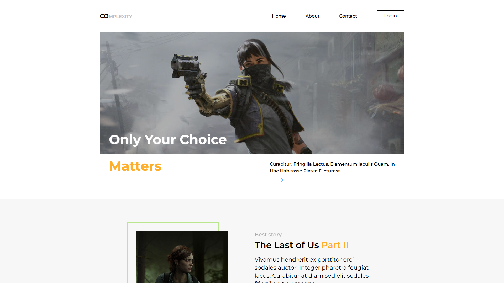

# Css Guidelines And Conventions

Live demo: [css-guidelines-and-conventions-three.vercel.app](https://css-guidelines-and-conventions-three.vercel.app)

I used this nice, simple, design to focus on writing clean css by following best practices and BEM conventions and using css variables. This is a responsive, mobile first, implementation. I also added unit and integration testing with jest and react testing library.

## Technologies

- Typescript
- React
- Css
- Jest
- React Testing Library

## Screenshots

